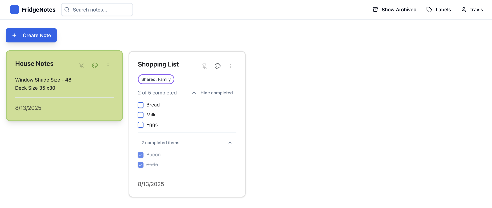
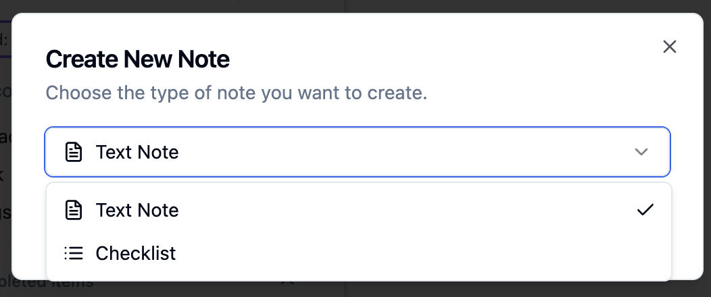
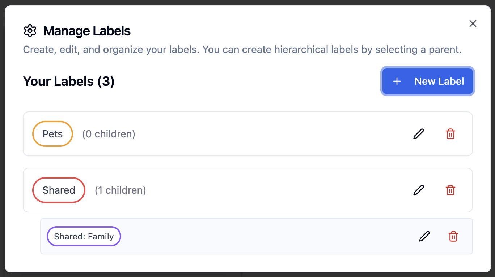
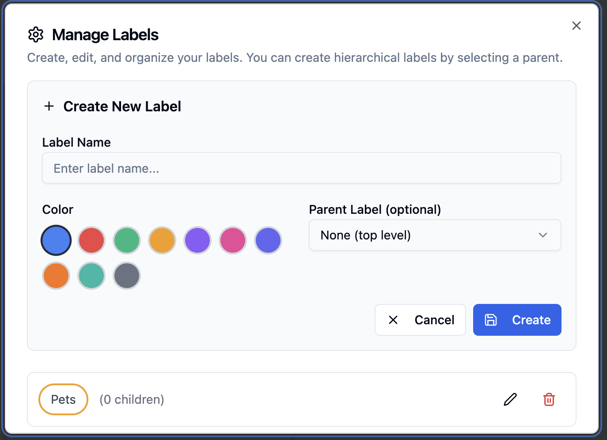
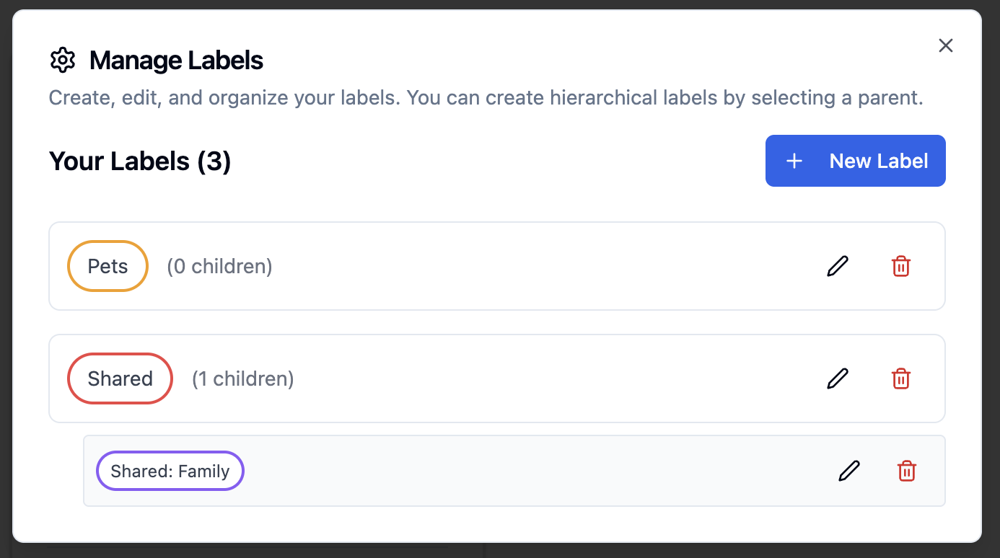
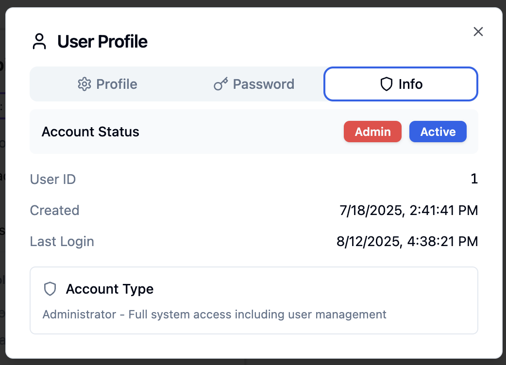

# FridgeNotes

A self-hosted, collaborative note-taking app built as a Progressive Web App. FridgeNotes is designed for households — shared shopping lists, family reminders, and personal notes, all in one place. Think of it as a self-hosted Google Keep with real-time collaboration and full control over your data.

## Features

**Notes & Lists**
- Text notes and interactive checklists (ideal for grocery and shopping lists)
- Pin important notes to the top
- Color-code notes with customizable themes
- Archive notes to declutter without deleting
- Drag and drop to reorder notes

**Collaboration**
- Share individual notes with other users (read or edit access)
- Real-time sync via WebSocket — changes appear instantly across all open sessions
- Per-user note ownership with admin-managed user accounts

**Organization**
- Color-coded labels with autocomplete suggestions
- Search notes by text content or filter by label using `label:name` syntax
- Smart autocomplete for checklist items — learns from your usage, ships with 50+ common grocery items
- Built-in and custom list templates for quick checklist creation

**Reminders**
- Set date/time reminders on any note
- Snooze reminders from the notification prompt

**Offline & PWA**
- Installable on Android, iOS, and desktop as a Progressive Web App
- Full offline support with an operation queue — edits made offline sync automatically when reconnected

**Data Management**
- Export all notes to JSON (full backup) or CSV (spreadsheet use)
- Import from a previous JSON backup to restore data

**Other**
- Dark and light themes with automatic system preference detection
- Responsive layout optimized for mobile and desktop
- Self-hosted — your data never leaves your server

## Screenshots

### Main Interface

*The main FridgeNotes interface showing notes in an organized grid layout*

### Creating Notes

*Note creation dialog with support for text notes and interactive checklists*

### Label System

*Color-coded labels for organizing notes*


*Create custom labels*


*Label management with editing tools*

### User Management

*User profile and admin controls*

---

## Installation

### Docker (Recommended)

The simplest way to run FridgeNotes in production.

**Prerequisites:** Docker and Docker Compose

```bash
# Clone the repository
git clone <repo-url>
cd FridgeNotes

# Start the application
docker-compose up -d
```

The app will be available at **http://localhost:5009**.

**Getting the admin password:**

On first startup, FridgeNotes creates an admin user with a randomly generated password and prints it to the logs:

```
FridgeNotes - INITIAL ADMIN ACCOUNT CREATED
Username: admin
Password: Abc123XyZ9
IMPORTANT: Save this password! It will not be shown again.
```

Retrieve it at any time with:

```bash
docker-compose logs fridgenotes | grep "Password:"
```

**Changing the exposed port:**

Edit `docker-compose.yml` and change the left side of the ports mapping:

```yaml
ports:
  - "8080:5009"   # now accessible at http://localhost:8080
```

> **Security note:** The `docker-compose.yml` ships with a hardcoded `SECRET_KEY`. You must replace it with a securely generated random value before running in any internet-accessible environment. See [Configuration](#configuration).

---

### Local Development

**Prerequisites:** Python 3.10+, Node.js 18+

**Backend:**

```bash
# Install Python dependencies
pip install -r requirements.txt

# Start the backend (runs on http://localhost:5009)
python src/main.py
```

**Frontend:**

```bash
# In a separate terminal
cd fridgenotes-frontend

# Install dependencies
npm install

# Start the development server (runs on http://localhost:5173)
npm run dev
```

The Vite dev server proxies all `/api` and WebSocket requests to the backend on port 5009. Both processes must be running simultaneously for full functionality.

---

## First-Time Setup

1. Start the application (Docker or local).
2. Find the admin password in the startup logs (see above).
3. Open the app and sign in as `admin`.
4. Change your password via the user profile menu.
5. Create accounts for other household members through the Admin Panel (profile menu → Admin Panel → Users → Create User).

**If you lose the admin password** and the logs have rotated, you can reset by wiping the database. This deletes all data:

```bash
docker-compose down
docker volume rm fridgenotes_data
docker-compose up -d   # new admin password printed to logs
```

---

## Usage

### Creating Notes

Click the compose area at the top of the main screen. Choose between a **text note** (freeform content) or a **checklist** (interactive list with checkboxes). Give the note a title and content, then click away to save.

### Sharing Notes

Open a note's options menu and select **Share**. Enter the username of the person you want to share with and choose either read or edit access. Shared notes appear in the recipient's note grid. The note owner can revoke access at any time.

Real-time collaboration is active on shared notes — if two people have the same checklist open, checking off an item is immediately visible to both.

### Labels

Create labels from the Labels section in the sidebar or from within a note. Labels have a name and a color. Apply one or more labels to any note.

To filter notes by label, type `label:labelname` in the search bar. Regular text search and label filters can be combined.

### Reminders

Open a note and set a reminder date and time via the reminder option. When the reminder fires, a notification appears in the app with options to dismiss or snooze.

### Drag and Drop

On the main grid, drag any note to a new position. The order is persisted to the server.

### Import / Export

Access import/export from the profile menu → **Import/Export**.

- **Export JSON** — full backup of all notes, checklists, and labels
- **Export CSV** — flat spreadsheet-friendly format
- **Import JSON** — restore from a previous JSON export

### Installing as a Mobile/Desktop App

FridgeNotes is a Progressive Web App and can be installed as a native-feeling app on any platform.

**Android (Chrome)**
1. Open FridgeNotes in Chrome
2. Tap the install prompt or the install icon in the address bar
3. Tap "Install" — the app is added to your home screen and app drawer

**iPhone / iPad (Safari)**
1. Open FridgeNotes in Safari
2. Tap the Share button (the box with an arrow)
3. Tap "Add to Home Screen"
4. Tap "Add"

**Desktop (Chrome / Edge)**
1. Open FridgeNotes in Chrome or Edge
2. Click the install icon in the address bar
3. Click "Install FridgeNotes"
4. The app appears in your Start Menu or Applications folder

Installed apps load faster, work fully offline, run without browser chrome, and update automatically.

---

## Architecture

FridgeNotes uses a separated frontend/backend architecture. In production, the React app is built to static files and served by the Flask backend. In development, the Vite dev server handles the frontend and proxies API calls to Flask.

### Tech Stack

| Layer | Technology |
|---|---|
| Frontend framework | React 18 + Vite |
| Frontend styling | Tailwind CSS + Radix UI |
| Frontend state | Composite hook pattern (custom hooks) |
| Backend framework | Flask + SQLAlchemy |
| Real-time | Flask-SocketIO (Socket.IO) |
| Database | SQLite |
| Deployment | Docker + Docker Compose |
| Offline support | Workbox service worker |

### Directory Structure

```
FridgeNotes/
├── src/                          # Flask backend
│   ├── main.py                   # App entry point, admin auto-creation
│   ├── models/                   # SQLAlchemy models (User, Note, Label, etc.)
│   ├── routes/                   # API blueprints (auth, note, label, user)
│   └── websocket_events.py       # Socket.IO event handlers
├── fridgenotes-frontend/         # React PWA
│   └── src/
│       ├── App.jsx               # Main orchestrator component
│       ├── components/           # UI components
│       └── hooks/                # Business logic hooks
├── docker-compose.yml
├── requirements.txt
└── Dockerfile
```

---

## API Reference

All endpoints are prefixed with `/api`. Requests and responses use JSON. Authentication is session-based (cookie).

### Auth

| Method | Endpoint | Description |
|---|---|---|
| POST | `/api/auth/login` | Log in with username and password |
| POST | `/api/auth/logout` | End the current session |
| GET | `/api/auth/check` | Check current authentication state |
| POST | `/api/auth/register` | Register a new user (admin only) |

### Notes

| Method | Endpoint | Description |
|---|---|---|
| GET | `/api/notes` | List all notes for the current user |
| POST | `/api/notes` | Create a new note |
| PUT | `/api/notes/:id` | Update a note |
| DELETE | `/api/notes/:id` | Delete a note |
| PUT | `/api/notes/reorder` | Persist a new note order |
| PUT | `/api/notes/:id/pin` | Toggle pin state |

### Checklist

| Method | Endpoint | Description |
|---|---|---|
| PUT | `/api/notes/:id/checklist-items/:itemId` | Update a checklist item (e.g., toggle checked) |

### Sharing

| Method | Endpoint | Description |
|---|---|---|
| POST | `/api/notes/:id/share` | Share a note with another user |
| DELETE | `/api/notes/:id/shares/:shareId` | Revoke a share |

### Labels

| Method | Endpoint | Description |
|---|---|---|
| GET | `/api/labels` | List all labels for the current user |
| POST | `/api/labels` | Create a label |
| PUT | `/api/labels/:id` | Update a label |
| DELETE | `/api/labels/:id` | Delete a label |
| POST | `/api/notes/:id/labels` | Apply a label to a note |
| DELETE | `/api/notes/:id/labels/:labelId` | Remove a label from a note |

### Reminders

| Method | Endpoint | Description |
|---|---|---|
| POST | `/api/notes/:id/reminder/complete` | Dismiss a reminder |
| POST | `/api/notes/:id/reminder/snooze` | Snooze a reminder |

---

## WebSocket Events

FridgeNotes uses Socket.IO for real-time collaboration. Clients join a user-specific room on authentication.

### Client → Server

| Event | Description |
|---|---|
| `join_user` | Join the authenticated user's room |
| `note_updated` | Broadcast a note edit to other sessions |
| `checklist_item_toggled` | Broadcast a checklist item state change |
| `notes_reordered` | Broadcast a new note order |

### Server → Client

| Event | Description |
|---|---|
| `note_update_received` | A note was updated by another session |
| `checklist_item_toggle_received` | A checklist item was toggled by another session |
| `notes_reorder_received` | Note order was changed by another session |

---

## Configuration

| Variable | Default | Description |
|---|---|---|
| `SECRET_KEY` | (hardcoded in `docker-compose.yml`) | Flask session signing key. **Must be changed** for any internet-facing deployment. Generate one with `python -c "import secrets; print(secrets.token_hex(32))"`. |
| `FLASK_ENV` | `production` | Set to `development` for debug mode and auto-reload. |

To set these, edit the `environment` block in `docker-compose.yml`:

```yaml
environment:
  - SECRET_KEY=your-securely-generated-random-value-here
  - FLASK_ENV=production
```

---

## Contributing

See [CLAUDE.md](CLAUDE.md) for a detailed description of the codebase architecture, key files, hook patterns, and development workflow. That document is the primary reference for anyone working on the code.

For backend changes, work in `src/models/` and `src/routes/`. For frontend changes, work in `fridgenotes-frontend/src/` — the Vite dev server supports hot reload. Database schema changes require a corresponding migration in `src/migrations.py`.
