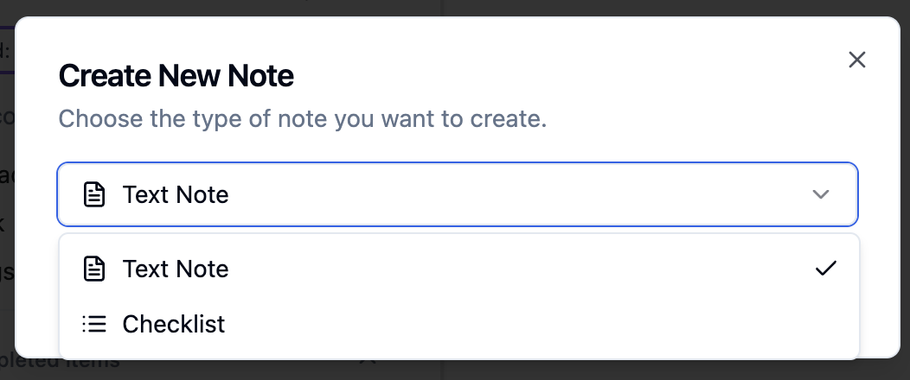

# FridgeNotes 📝

A modern **Progressive Web App** for collaborative note-taking, perfect for family shopping lists, shared reminders, and organizing your thoughts. Install it like a native app on any device with offline support, dark mode, and real-time collaboration.

## ✨ **Key Features**

- 📱 **Progressive Web App** - Install on phones, tablets & desktops
- 🌙 **Dark Mode** - Beautiful light/dark themes with system preference detection  
- 🔄 **Real-time Collaboration** - Share notes with family members instantly
- 📶 **Offline Support** - Works completely without internet after installation
- 🏷️ **Smart Labels** - Organize notes with color-coded labels and autocomplete
- ✅ **Shopping Lists** - Interactive checklists perfect for grocery shopping
- 🎨 **Note Colors** - Personalize notes with beautiful color themes
- 🔒 **Self-Hosted** - Complete control over your family's data
- ⚡ **Fast & Responsive** - Optimized for mobile and desktop use

## 📸 Screenshots

### Main Interface

*The main FridgeNotes interface showing your notes in an organized grid layout*

### Creating Notes

*Easy note creation with support for both text notes and interactive checklists*

### Label System

*Organize your notes with color-coded labels for better categorization*


*Create custom labels to organize your notes*


*Comprehensive label management with editing and organization tools*

### User Management

*User profile management and admin controls*

## 📱 **Install as Mobile App**

FridgeNotes is a Progressive Web App that can be installed on any device:

### **Android (Chrome)**
1. Visit your FridgeNotes site in Chrome
2. Look for the install notification or ⊕ icon in the address bar
3. Tap "Install" and the app will be added to your home screen
4. Launch from your app drawer like any native app

### **iPhone/iPad (Safari)**
1. Open your FridgeNotes site in Safari
2. Tap the Share button (□↗)
3. Scroll down and tap "Add to Home Screen"
4. Tap "Add" to install the app

### **Desktop (Chrome/Edge)**
1. Visit your FridgeNotes site
2. Look for the install icon in the address bar
3. Click "Install FridgeNotes"
4. App appears in your Start Menu/Applications folder

**Benefits of Installing:**
- ⚡ **Faster loading** from your home screen
- 📶 **Works offline** - access notes without internet
- 🔔 **Native feel** - no browser UI, full-screen experience
- 🔄 **Auto-updates** - always get the latest features

## 🚀 Quick Start

### Prerequisites
- Docker and Docker Compose installed
- Port 5009 available (or modify in docker-compose.yml)

### 1. Deploy with Docker Compose

```bash
# Clone or navigate to your project directory
cd fridgenotes

# Start the application
docker-compose up -d

# Check the logs for admin credentials
docker-compose logs fridgenotes
```

### 2. Get Your Admin Credentials

On first startup, the application will create an admin user with a randomly generated secure password. Look for this in the Docker logs:

```
🔐 FridgeNotes - INITIAL ADMIN ACCOUNT CREATED
📧 Username: admin
🔑 Password: Abc123XyZ9
⚠️  IMPORTANT: Save this password! It will not be shown again.
```

**Important**: Copy this password immediately - it will only be displayed once!

### 3. Access Your Application

1. Open your browser and go to: `http://localhost:5009`
2. Click "Sign In" 
3. Use username: `admin` and the generated password from the logs
4. Change your password in the user profile settings
5. Create additional users through the admin panel

### 4. Create Additional Users

As the admin user:
1. Click on your profile menu
2. Select "Admin Panel"
3. Go to the "Users" tab
4. Click "Create User" to add family members or additional users

## 🔒 Security Features

### First-Time Setup Security
- **No default passwords** - Each installation gets a unique admin password
- **Secure password generation** - 10-character random passwords with mixed case and numbers
- **One-time display** - Admin password shown only once in startup logs
- **Immediate password change** - Admin can change password after first login

### User Management
- **Admin-controlled user creation** - Only admins can create new users
- **Secure password requirements** - Minimum 6 characters for user passwords
- **Session management** - Secure login sessions with configurable duration
- **Account deactivation** - Admins can deactivate users without deleting data

## 📋 Getting Your Admin Password

If you missed the admin password in the logs, you can retrieve it by checking the Docker logs:

```bash
# View recent logs
docker-compose logs fridgenotes | grep "Password:"

# Or view all startup logs
docker-compose logs fridgenotes
```

If you've lost the admin password completely, you can reset the database (⚠️ this will delete all data):

```bash
# Stop the container
docker-compose down

# Remove the database volume (WARNING: deletes all data!)
docker volume rm fridgenotes_data

# Start again (will create new admin with new password)
docker-compose up -d
```

## 🔧 **Technical Features**

### **Progressive Web App**
- **Service Worker** - Offline functionality and background sync
- **Web App Manifest** - Native app installation on all platforms
- **Responsive Design** - Optimized for mobile, tablet, and desktop
- **App Icons** - Beautiful icons for all device home screens
- **Fast Loading** - Cached resources for instant startup

### **Modern Frontend**
- **React 18** - Latest React with hooks and functional components
- **Vite** - Lightning-fast build tool with hot reload
- **Tailwind CSS** - Utility-first styling with dark mode support
- **Radix UI** - Accessible component library
- **Workbox** - Advanced service worker with smart caching

### **Robust Backend**
- **Flask** - Python web framework with SQLAlchemy ORM
- **WebSocket** - Real-time collaboration with Socket.IO
- **SQLite** - Lightweight database with automatic migrations
- **RESTful API** - Clean API design with proper error handling
- **Docker** - Containerized deployment with health checks

### **Smart Features**
- **Label Autocomplete** - Intelligent label suggestions with search
- **Theme System** - Light/dark mode with system preference detection
- **Offline Sync** - Works completely without internet connection
- **Real-time Updates** - Instant collaboration across devices
- **Drag & Drop** - Intuitive note organization
- **Search** - Fast full-text search across all notes

## 🏗️ **Architecture**

```
FridgeNotes/
├── 📱 Frontend (React PWA)
│   ├── Service Worker (offline support)
│   ├── Web App Manifest (app installation)
│   ├── Responsive UI (mobile-first design)
│   └── Real-time sync (WebSocket)
├── 🔄 Backend (Flask API)
│   ├── RESTful endpoints
│   ├── WebSocket events
│   ├── User authentication
│   └── Database models
├── 📊 Database (SQLite)
│   ├── Users & permissions
│   ├── Notes & checklists
│   ├── Labels & organization
│   └── Sharing & collaboration
└── 🐳 Deployment (Docker)
    ├── Production-ready container
    ├── Health checks
    ├── Volume persistence
    └── Proxy compatibility
```

## 🌟 **Why Choose FridgeNotes?**

- **🔒 Privacy First** - Self-hosted means your data stays with you
- **📱 Modern Experience** - PWA technology for native app feel
- **👨‍👩‍👧‍👦 Family Friendly** - Designed for household collaboration
- **⚡ Performance** - Fast, responsive, works offline
- **🎨 Beautiful Design** - Clean interface with dark mode
- **🔧 Easy Setup** - One-command Docker deployment
- **🔄 Always Updated** - Regular feature updates and improvements

**Perfect for families who want a private, feature-rich alternative to Google Keep or Apple Notes!** 🏠✨